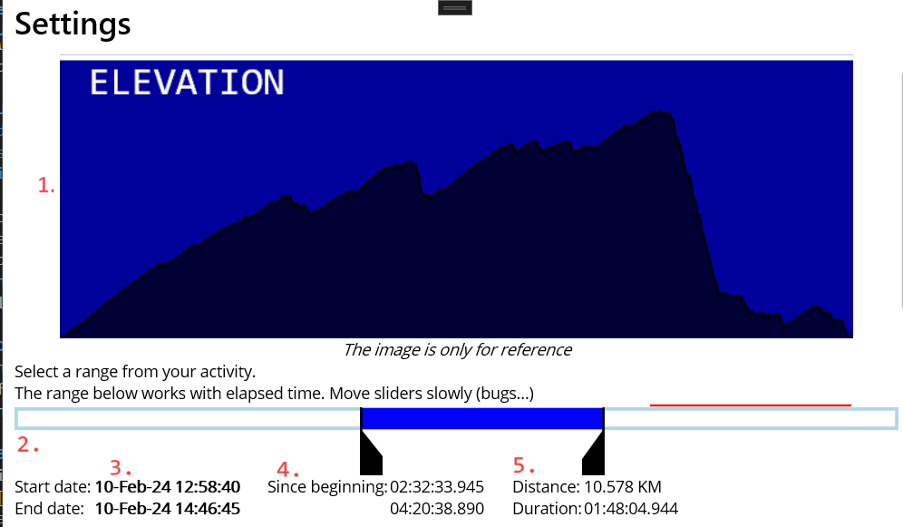
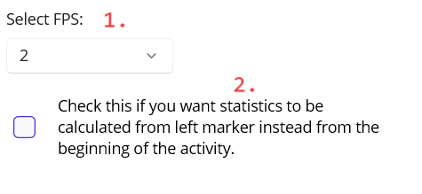
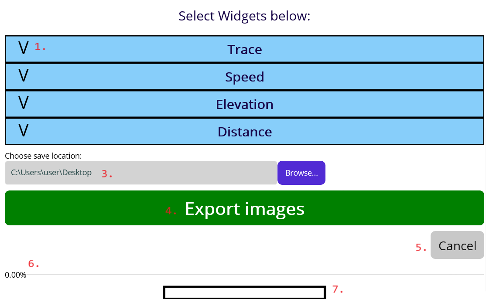
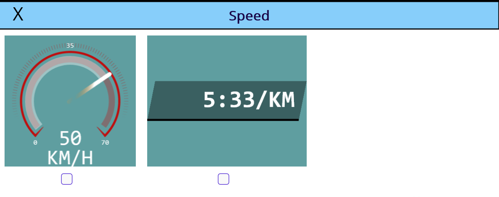
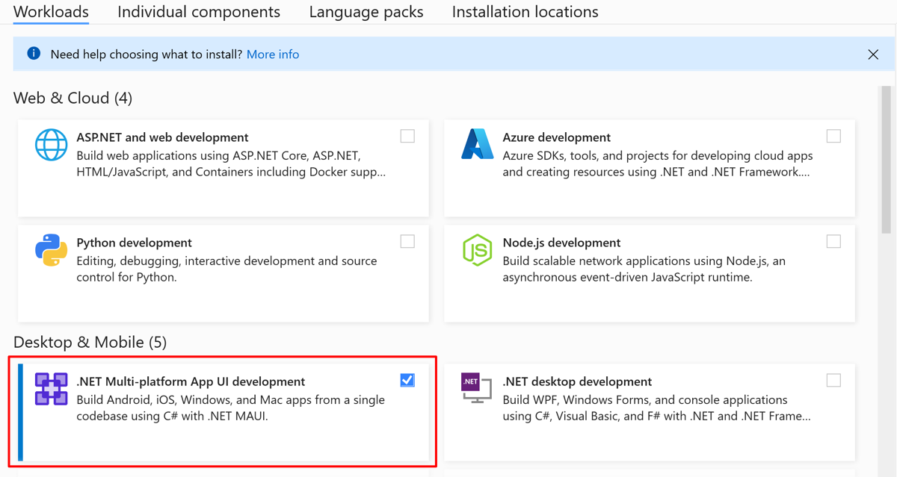

# Telemetry Exporter

Export telemetry data (frames) from Garmin activity.  
Since Garmin Virb is not so usable, this program will replace part of its functionality related to exporting the `png overlays`.  
Although this project gives opportunity to develop any kind of widget, depends on demands  

<!-- this is uploaded somewhere in github, for some reason it not working when refereced from repository -->
https://github.com/M-Yankov/TelemetryExporter/assets/10440078/203a892f-10af-4912-82f8-a688acd40a5e

## Usage
Check the video below for detailed usage:  

## Download
- Go to [Releases](https://github.com/M-Yankov/TelemetryExporter/releases) page and download the latest
- No need install
- Extract _.zip_ contents
- Open `TelemetryExporter.UI.exe`

For now only Windows 10, 11 is supported (MacOS could be added in future, but may need help)

## User data privacy
- This program doesn't use any personal data
- This program doesn't share data to 3-rd party service
- This program doesn't require registration
- It's free and open-source, the owner (developers, contributors) doesn't take responsibility for any malfunctions caused by the bugs
- Using this program is at your own risk

## Usage

- You need the `.fit` file activity from
 Garmin device or downloaded from their website (https://connect.garmin.com/)
- Open `Telemetry Exporter` and select the `.fit` file
- In `Telemetry Exporter` configure the settings you want and select widgets
- Click `Export` and take a coffee :)

## Detailed description
- In the first page you need to enter the `.fit` file from Garmin
- After loading the file, the second page with settings appears
- The settings:

1. The elevation profile (calculated from active time)
1. The activity range (_showing **total elapsed** time_)
   - Consist of two black sliders (start/end)
     - Move this slider smoothly, they are buggy
   - The blue area is the selected area for export
   - the thin red lines indicates paused intervals
1. The start and end of the sliders - local datetime
   - The dates blinks in green background when ranges sliders moved (_if not, try move sliders again_), **green background indicates the value of the slider is saved.**
1. Start/end since beginning (00:00:00 default for _start_) (default for _end_ is the duration of the activity)
1. Distance and duration of the selected range

More settings:  
  

1. The frames per second
   - It's highly recommended to use lower value here, because of duplicated frames. 60 will generate a lot of duplicated frames which is unnecessary.
 Later in the video-editing program change the duration of the imported frames 2fps = 500ms, 4fps = 250. In general duration = 1000 / fps
2. This checkbox will threat the left marker as beginning of the activity
   - It's good when you want to show a part from your activity

Widgets:  

1. Each category is expandable where widgets can be selected
1. ?
1. Browse save location, final result is zip archive with name in GUID format (_152a22da-d19e-4b87-bd85-153f9a0f3633.zip_), default location is desktop
1. The export button initiating the process of generating frames
1. With the Cancel button generation of frames can be stopped
1. The status of overall export process
1. Each widgets reports its progress (_this could be removed in future_)

Widgets selection:  

Each category may contain one or more widgets presented with an example image. To select widget click the checkbox below the widget.

**At least one widget needs to be selected.**

## Development
- Visual Studio 2022 (_or newer_) with installed tools for MAUI development
- 
- Set-up `TelemetryExporter.UI` as start-up project
- Hit `F5` to run te project
- .NET 8 with C# 12

Checkout more info about [Getting started with MAUI](https://learn.microsoft.com/en-us/dotnet/maui/get-started/first-app?pivots=devices-windows&view=net-maui-8.0&tabs=vswin) and [Visual Studio 2022 MAUI release](https://devblogs.microsoft.com/dotnet/dotnet-maui-visualstudio-2022-release/)

### Contribution
- It's absolutely free for anyone to open PRs with fixes or new functionality
  - If need help use Discussion tab
- For problems and bugs use [Issues page](https://github.com/M-Yankov/TelemetryExporter/issues)

### Technical info:
In case of error, this temporary directory contains generated frames:
> `C:\Users\<your-user-name>\AppData\Local\M-Yankov\com.telemetryexporter\Cache`

Contents can be safety deleted.

### Future
- More widgets will be added (_from garmin virb_)
- Each widget could have separate settings (size, font, color scheme etc.)
- More configuration settings will be added, check [Issues](https://github.com/M-Yankov/TelemetryExporter/issues)
- integrating map layers as navigation
- quick fixes
- Possibility to set exact start/end times (_to second_)
- The MAUI seems not a stable technology for extensibility, may try something different in future
